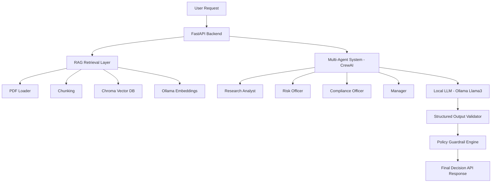

# 🧠 AI Loan Decision Copilot (Multi-Agent RAG System)

A production-style decision intelligence system that combines Retrieval-Augmented Generation (RAG), multi-agent reasoning, and deterministic policy enforcement to evaluate loan applications.

Unlike standard chatbots, this system prevents hallucinated approvals by integrating an LLM reasoning layer with a rule-based compliance engine.

---

## 🧠 System Architecture




---

# What this diagram communicates to recruiters

Without reading code they instantly see:

- RAG architecture ✔
- multi-agent orchestration ✔
- local LLM hosting ✔
- guardrail enforcement ✔
- production API ✔

This screams **GenAI Engineer**, not student.

---

# 🧠 AI Loan Decision Copilot (Multi-Agent RAG System)

A production-style decision intelligence system that combines Retrieval-Augmented Generation (RAG), multi-agent reasoning, and deterministic policy enforcement to evaluate loan applications.

Unlike standard chatbots, this system prevents hallucinated approvals by integrating an LLM reasoning layer with a rule-based compliance engine.

---

## ✨ Features

- 📄 Upload company policy documents (PDF)
- 🔍 Retrieval-Augmented Generation (RAG) over internal knowledge
- 👥 Multi-agent reasoning using CrewAI
- 🧠 Local LLM inference via Ollama (no API cost)
- 🛡️ Deterministic guardrail engine prevents hallucinated approvals
- 📊 Structured JSON decision output
- 🌐 Production-ready FastAPI endpoints

---

## 🧪 Example Decision Output

```json
{
  "decision": "REJECT",
  "violated_rules": [
    "credit_score_below_650",
    "collateral_required",
    "high_dti_manual_review"
  ],
  "ai_reasoning": "Credit score violates policy section 3 and collateral requirement not satisfied."
}
```

---

## 🚀 API Endpoints

| Endpoint | Description |
|--------|------|
| `POST /upload-doc` | Upload policy document |
| `POST /ask` | Ask questions from documents |
| `POST /decision` | Single-agent decision |
| `POST /crew-decision` | Multi-agent decision engine |

---

## 🧠 Tech Stack

- **LangChain** — RAG pipeline
- **ChromaDB** — Vector database
- **CrewAI** — Multi-agent orchestration
- **Ollama (Llama3)** — Local LLM inference
- **FastAPI** — Backend service
- **Pydantic** — Structured outputs

---

## 🏗️ Key Engineering Concept

This project implements a **Hybrid AI Architecture**:

> LLMs generate reasoning, deterministic rules enforce compliance.

This prevents AI hallucinations in high-risk decision systems such as fintech approvals or insurance claims.
